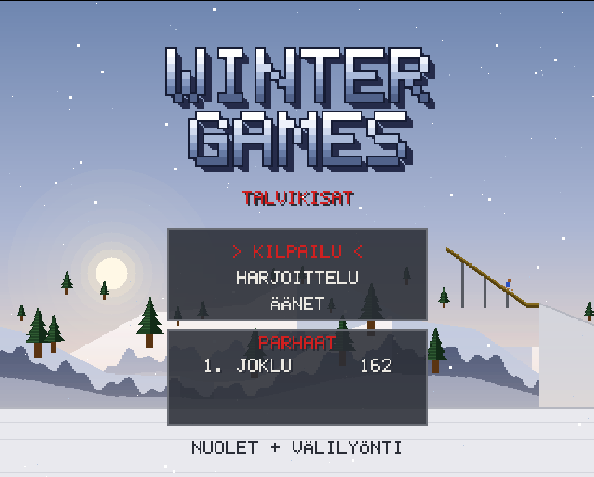

# Winter Games – Talvikisat

Retrohenkinen (Amiga/VGA-tyyli) talviurheilupeli selaimessa. Kolme lajia: **mäkihyppy**, **pujottelu** ja **ohjaskelkkailu**. Voittaja on se, jolla on eniten yhteispisteitä.



**Pelaa:** <https://jounijokelainen.github.io/winter-games/peli/>
**Tulostaulu:** <https://jounijokelainen.github.io/winter-games/>

## Pelin kulku

Päävalikossa on kolme valintaa ja alla kolme parasta yhteispistemäärää:

- **Kilpailu:** valitset nimimerkin ja pelaat kolme lajia järjestyksessä (mäkihyppy, pujottelu, ohjaskelkkailu). Kussakin lajissa on **kolme yritystä**, ja lajin pisteiksi jää paras hyväksytty yritys. Kilpailun lopuksi näet yhteispisteet, ja tulos tallentuu tulostaululle.
- **Harjoittelu:** valitset yksittäisen lajin ja yrität niin monta kertaa kuin haluat. Tuloksia ei tallenneta. Poistut Escillä.
- **Äänet:** musiikin päälle ja pois sekä musiikin ja äänitehosteiden voimakkuus.

Yhteispisteet ovat enintään **200** (mäkihyppy 80 + pujottelu 60 + ohjaskelkkailu 60). Jos kaikki kolme yritystä hylätään tai päättyvät kaatumiseen, lajista saa 0 pistettä ja peli jatkuu seuraavaan lajiin.

## Ohjaus

| Näppäin | Mäkihyppy | Pujottelu | Ohjaskelkkailu |
|---|---|---|---|
| Välilyönti | lähtö, ponnistus, alastulo | lähtö ja vauhti (naputtele) | lähtö ja työntö (naputtele) |
| ← / → | lentoasennon säätö | kääntyminen | ohjaus |
| ↓ | – | – | jarru |
| Esc | taukovalikko | taukovalikko | taukovalikko |

Esc avaa taukovalikon, josta voit jatkaa, mykistää äänet tai lopettaa. Keskeytetty kilpailu ei tallennu.

## Säännöt ja pisteet

### Mäkihyppy (enintään 80 pistettä)

- Jokaisella hypyllä on satunnainen **myötätuuli** (0–4 m/s), jonka näet ruudun yläkulman tuuliviirinä. Myötätuuli kasvattaa vauhtia, mutta kaventaa ponnistuksen ajoitusikkunaa.
- **Lähtö:** välilyönti.
- **Ponnistus:** välilyönti oikealla hetkellä hyppyrin nokalla.
  - Liian aikaisin: heikompi ponnistus ja lyhyempi hyppy.
  - Ei ponnistusta: lyhyt hyppy ja heikko vauhti.
  - Liian myöhään: kaatuminen.
- **Lento:** nuoli vasemmalle nostaa hahmoa pystympään ja nuoli oikealle laskee sitä vaakasuorempaan. Kulma ajelehtii itsestään (puuskat, painovoima), joten korjaat sitä koko lennon. Paras kulma on **45 astetta**.
- **Alastulo:** välilyönti ennen maahan koskemista. Ruudun alareunan palkki näyttää arvioidun ajan kosketukseen, ja vihreällä alueella lukee **NYT!**
  - 0,6–0,05 s ennen kosketusta (viimeinen painallus): täydellinen alastulo, **20 p**.
  - Yli 0,6 s ennen kosketusta: huono alastulo, **5 p**.
  - Myöhemmin tai ei lainkaan: **kaatuminen, 0 p** koko hypystä.
- **Pisteet:** pituuspisteet = 60 − 2 × (200 − pituus metreinä), alaraja 0, ja alastulopisteet päälle.
- **Pisin mahdollinen hyppy on 200 m.** Siihen pääsee vain kovalla tuulella ja lähes täydellisellä suorituksella. Tyynellä paras tulos on noin 190 m.

### Pujottelu (enintään 60 pistettä)

- Rata on aina sama: **23 keppiä**, jotka kierretään vuorotellen vasemmalta ja oikealta (punaiset ja siniset kepit), ja lopussa kepitön kiihdytysosuus maaliin.
- **Lähtö:** välilyönti. Välilyönnin naputtelu kiihdyttää.
- Nuolet kääntävät suksien kulmaa. Kääntyminen hidastaa vauhtia, ja liian kova vauhti vaikeuttaa keppien kiertämistä.
- Keppiin osuminen hidastaa vauhtia.
- **Hylkäys:** kaksi kiertämätöntä keppiä tai ajautuminen ulos rinteestä.
- **Pisteet:** 60 − 3 × (jokainen aloitettu sekunti yli 30 s) − 10 × törmäykset − 20 × kiertämättömät kepit, alaraja 0.
- Voimaan jää parhaat pisteet saanut hyväksytty lasku.

### Ohjaskelkkailu (enintään 60 pistettä)

- **Lähtö:** välilyönti. Aika alkaa heti, joten myös työntövaihe lasketaan aikaan.
- **Työntö:** naputtele välilyöntiä punaiseen viivaan (20 m) asti. Noin 4,5 naputusta sekunnissa antaa enimmäisvauhdin, ja mitä parempi työntö, sitä parempi vauhti mäessä. Hahmo hyppää kelkkaan automaattisesti viivan kohdalla.
- **Ohjaus:** nuolet vasemmalle ja oikealle ohjaavat, ja nuoli alas jarruttaa.
  - Käännöksen ulkolaita kiihdyttää, keskellä vauhti pysyy ja sisälaita hidastaa.
  - Käännöksessä kelkka liukuu kohti ulkoseinää sitä enemmän, mitä suurempi vauhti ja mitä jyrkempi käännös. Ohjaa sisäänpäin ja jarruta, muuten kelkka lentää reunan yli ja suoritus **hylätään**. Reunan lähellä kuuluu varoitusääni.
  - Yli 45 s kestävä lasku hylätään.
- **Pisteet:** 60 − 5 × (jokainen aloitettu sekunti yli 30 s), alaraja 0.
- Voimaan jää nopein hyväksytty lasku.
- Harjoituksessa oranssi katkoviiva näyttää ihannelinjan. Kilpailussa sitä ei näy.

### Tavoiteajat

Pujottelussa ja ohjaskelkkailussa 30 sekunnin tavoiteaika vaatii erinomaisen suorituksen. Keskiverto suoritus kestää 33–36 sekuntia, mistä saa pujottelussa noin 40–50 ja kelkkailussa noin 30–45 pistettä.

## Nimimerkit ja tulostaulu

- Nimimerkissä on enintään 10 merkkiä (isot kirjaimet A–Ö ja numerot). Salasanaa ei kysytä.
- Tulokset menevät jaetulle tulostaululle, jos peli saa yhteyden siihen. Muuten ne tallentuvat selaimeen. Lopputuloksissa lukee, minne tulos meni.
- **Nimimerkin suoja:** nimimerkin varaa se laite, joka tallentaa tuloksen ensimmäisenä sillä nimellä. Lopputuloksissa näkyy **palautuskoodi** (16 merkkiä). Kirjoita se ylös, sillä jos vaihdat laitetta tai tyhjennät selaimen tiedot, saat nimimerkin takaisin vain koodilla. Jos nimi on toisen laitteen varaama, peli kysyy palautuskoodia. Ilman koodia valitset uuden nimen.

## Pelaaminen omalla koneella

Tarvitset vain **Node.js 20 tai uudemman**. Npm-paketteja ei asenneta.

```
git clone https://github.com/JouniJokelainen/winter-games.git
cd winter-games
npm start
```

Avaa sitten <http://localhost:8080>. Paikallisessa pelissä tulokset tallentuvat palvelimelle ja tiedostoon `docs/leaderboard.json`.

| Komento | Mitä tekee |
|---|---|
| `npm start` | käynnistää pelin ja tulospalvelimen portissa 8080 (`PORT` vaihtaa portin) |
| `npm run dev` | kehitystila: tulokset menevät erilliseen tiedostoon, eikä mitään commitoida eikä pushata |
| `npm test` | ajaa testit |
| `npm run build:site` | rakentaa GitHub Pages -sivuston hakemistoon `_site` |

## Projektin rakenne

- `game/` – peli (HTML5 Canvas, tavallinen JavaScript, ei riippuvuuksia). Kaikki grafiikka piirretään koodilla, ja äänet ja musiikki syntetisoidaan Web Audiolla.
- `docs/` – tulostaulusivu ja tarkka määrittely (`docs/spec.md`).
- `server/` – paikallinen Node-palvelin tuloksille.
- `scripts/` – GitHub Pages -sivuston rakennus.
- `tests/` – testit (`node --test`).
- `plans/` – suunnitelma- ja suunnitteludokumentit.
